<!-- ===================================================================== -->
<!--  Carlton-L profile README · patch network  ·  edit assets/patch-banner.svg -->
<!-- ===================================================================== -->

  

<h3 align="center">Designer who deploys. Engineer who dreams. I build what I design.</h3>

  I build <b>AI-native interfaces</b> — knowledge graphs, node-based pipelines, and research
  tools where people steer AI systems. I design them <i>and</i> I ship them.

  <a href="https://carlton.dev">carlton.dev</a> &nbsp;·&nbsp;
  <a href="https://linkedin.com/in/carltonl">LinkedIn</a> &nbsp;·&nbsp;
  <a href="mailto:carlton@carlton.dev">carlton@carlton.dev</a>

 

## ` ▸ ` currently&nbsp;cooking

| node | what it is |
| :--- | :--- |
| **[carlton.dev](https://carlton.dev)** | My portfolio, built as a live dataflow patch — typed operators, real message-passing cables, and a dither background you can tweak. Astro + vanilla-JS runtime. |
| **[FAST](https://carlton.dev/projects/fast)** | Analysis & synthesis platform: knowledge-graph visualization, node-based analysis workflows, and LLM invention tools. Led frontend + UX end to end. |
| **[Futurescaper](https://carlton.dev/projects/futurescaper)** | A futures-exploration tool — custom graph layouts and AI orchestration for navigating scenario spaces. |
| **[GRID — Kinetic Light](https://carlton.dev/projects/grid-lamp)** | A motion-reactive kinetic light installation. Real-time 3D studio scene in the browser. |
| **RAG digital twin** | A self-hosted retrieval-augmented chatbot of my own work — Ollama + sqlite-vec on a Pi 5, zero API cost. *(wiring it up)* |

 

## ` ▸ ` stack

**Design → Build**
&nbsp;

**3D & Motion**
&nbsp;

**AI & Backend**
&nbsp;

 

## ` ▸ ` the&nbsp;snake&nbsp;eats&nbsp;the&nbsp;graph

<picture>
  <source media="(prefers-color-scheme: dark)" srcset="https://raw.githubusercontent.com/Carlton-L/Carlton-L/output/github-snake-dark.svg" />
  <source media="(prefers-color-scheme: light)" srcset="https://raw.githubusercontent.com/Carlton-L/Carlton-L/output/github-snake.svg" />
  
</picture>

 

  <code>◆</code> &nbsp; Built as a patch. Cables carry real signals. &nbsp; <code>◆</code>

